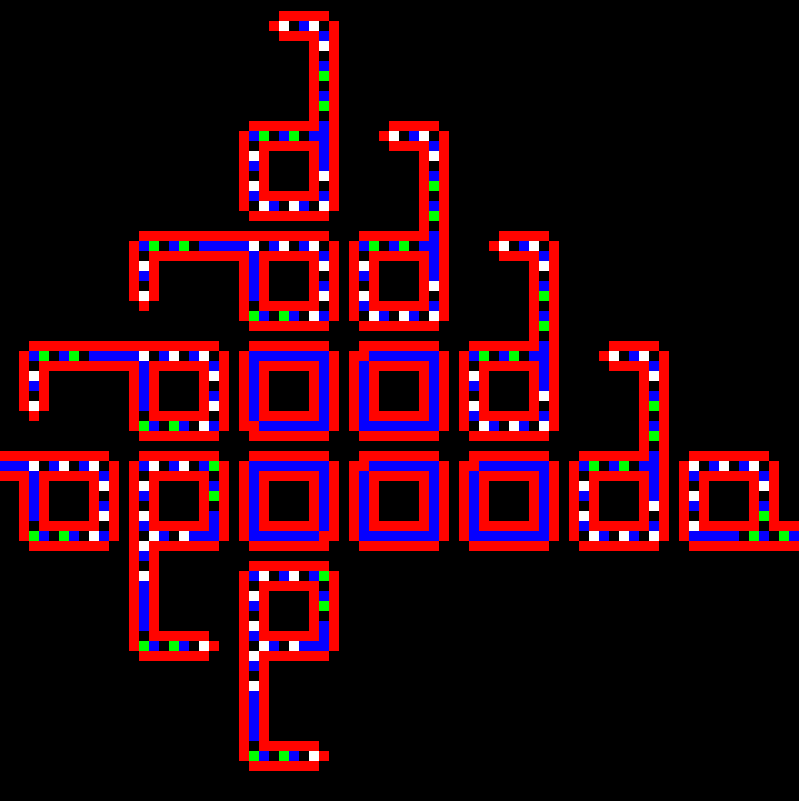

<!--
Copyright 2020 Malte Kliemann, Ole Kliemann

This file is part of DrAutomaton.

DrAutomaton is free software: you can redistribute it and/or modify it
under the terms of the GNU General Public License as published by the
Free Software Foundation, either version 3 of the License, or (at your
option) any later version.

DrAutomaton is distributed in the hope that it will be useful, but
WITHOUT ANY WARRANTY; without even the implied warranty of
MERCHANTABILITY or FITNESS FOR A PARTICULAR PURPOSE.  See the GNU
General Public License for more details.

You should have received a copy of the GNU General Public License along
with DrAutomaton.  If not, see <https://www.gnu.org/licenses/>.
-->

# DrAutomaton

**DrAutomaton** is a Qt-based library for displaying and interacting with 2D
cellular automata.

   &emsp; &emsp; &emsp; 

### Announcments

Release v0.1.x is now available. For details, see
[changelog](CHANGELOG.md).

### Getting started

* [Building **DrAutomaton**](docs/build.md)

* [User guide](docs/tutorial.md)

### Features

* Currently implemented rules: see the [Sample gallery](docs/samples.md)

* Run cellular automata on euclidean and non-euclidean geometries

## Requirements

### Supported platforms

**DrAutomaton** is currently supported on Windows, Linux and macOS.

### Build requirements

The basic requirements for building and using **DrAutomaton** are:

* A C++17-standard-compliant compiler

* [CMake](https://cmake.org) (`>= 3.13`)

* [Qt](https://www.qt.io) (`>= 5.14`)

_Optional_ requirement (required to execute all tests):

* [DrMock](https://github.com/DrCpp/DrMock) (`>= 0.3.0`), our testing/mocking framework

Note that this dependency cannot be satisfied on Windows,
as DrMock is currently not supported there.

## Contributing to **DrAutomaton**

You are cordially invited to contribute to **DrAutomaton** by reporting
and fixing bugs, and by proposing and implementing new features. 

To report bugs or request a feature, raise an issue in this repository.
Make a pull request if you wish to fix a bug or implement a new feature.

When making a pull request, please ensure the code is properly unit
tested, and that all tests pass. If changes are made to the rendering
system, please mind that **DrAutomaton** succeeds to build and passes
the unit tests on _all_ supported platforms (with the exception of tests
that require DrMock on Windows).

### Licensing

All contributions will be issued under the GPL 3.0 license. All new
files must include a GPL 3.0 license stub, including your authorship
copyright.

### Code style

When contributing code, please follow the style of existing **DrAutomaton**
source code.
