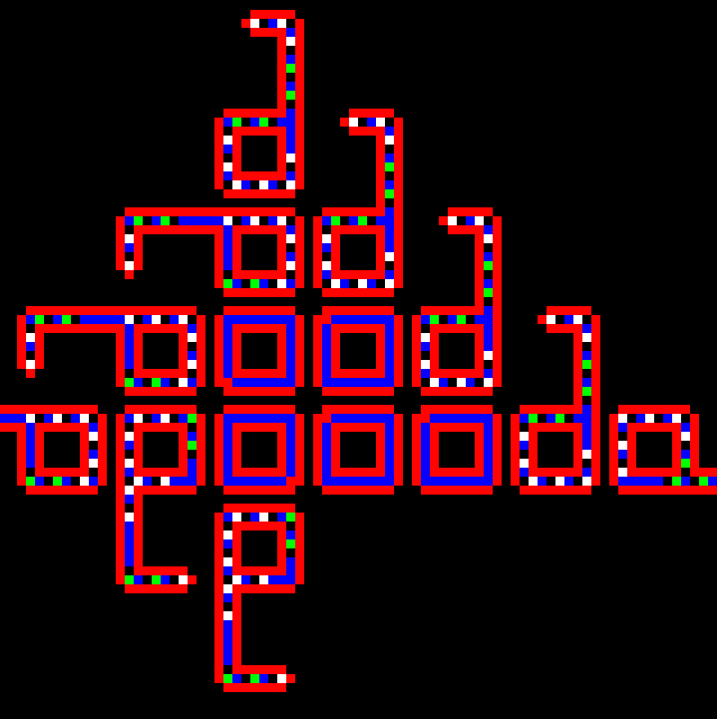

<!--
Copyright 2020 Malte Kliemann, Ole Kliemann

This file is part of DrAutomaton.

DrAutomaton is free software: you can redistribute it and/or modify it
under the terms of the GNU General Public License as published by the
Free Software Foundation, either version 3 of the License, or (at your
option) any later version.

DrAutomaton is distributed in the hope that it will be useful, but
WITHOUT ANY WARRANTY; without even the implied warranty of
MERCHANTABILITY or FITNESS FOR A PARTICULAR PURPOSE.  See the GNU
General Public License for more details.

You should have received a copy of the GNU General Public License along
with DrAutomaton.  If not, see <https://www.gnu.org/licenses/>.
-->

# DrAutomaton sample projects

Sample projects that use **DrAutomaton** may be found in `samples/`.

---

### Brian's brain free-for-all

Developed by Brian Silverman,
Brian's Brain is a variation on Conway's Game of Life.
Cells are _on_ (or alive), _dying_ or _off_ (or dead),
mirroring the possible states of a neuron.
Cells hat die go into an intermittent _dying_ state,
then turn _dead_.

Brian's Brain automata tend to explode
from a small amounts of cells into huge chaotic clusters of swirling
_spaceships_.
In this example,
we create a small random rect of _on_ and _dying_ cells
in the center of a torus.
Soon,
the torus will crawl with _on_/_dying_ cells.

For details, see
[Wikipedia: Brian's Brain](https://en.wikipedia.org/wiki/Brian%27s_Brain).

---

### Cyclic automaton

A cyclic automaton's states each have a unqiue _successor_ state.
Usually the states are called `0, ... , N-1`,
where `1` succeeds `0`, etc. and `0` succeeds `N-1`.
The rules are simple:
If a cell contains a successor in it's neighborhood,
the cell assumes the succeeding state.

In the sample,
the space is initialized with random cells. 
Soon,
the cells will organize into blocks of color,
finally giving rise to _demons_,
from which spiral of color emenate.
You can see a very young demon in the lower middle part of the image.

On the technical side,
this is an example of a rule that uses a state type that's not an `enum`.
This particular automaton lives on a torus, but practically any other geometry seems feasible.

For details, see
[Wikipedia: Cyclic cellular automaton](https://en.wikipedia.org/wiki/Cyclic_cellular_automaton).

---

### Gosper's glider gun

_Gosper's glider gun_ is the first _glider gun_ in J.H. Conway's Game of Life,
discovered by B. Gosper in 1970,
a periodic cellular automaton that emits _spaceships_.
In particular,
this pattern yields an ever increasing total number of live cells,
disproving a previous conjecture by Conway.

Gosper's glider gun is one of many examples
(alongside Langton's loops below)
that display infinite reproduction capability,
linking the notion of cellular automaton
to research about artificial life
and von Neumann's ideas about the colonization of Mars
(see [Inventing Game of Life (John Conway) - Numberphile](https://www.youtube.com/watch?v=R9Plq-D1gEk)).

We create the illusion that this automaton lives on an infinite plane
by only viewing a small vista of a slightly larger rectangular space
with a border for the gliders to crash into right outside the CA's viewport.

For details, see [Wikipedia: Gun](https://en.wikipedia.org/wiki/Gun_(cellular_automaton)).

---

### Langton's self-replicating loops

Published by C.G. Langton in [1].
_Langton's self-replicating loops_ (SR loops)
are capable of reproducing or cloning themselves up to four times before dying,
and exhibit a structure that somewhat resembles that of a biological cell.
Recent modifications of Langton's transition table introduce concepts
like natural selection, disease and sexual activity.

Langton's loops rotationally symmetric transition table
is implemented using an `std::unordered_map` with four items per transition (one for each rotation),
which is surprisingly fast.
We create the illusion that this automaton lives on an infinite plane
by only viewing a small vista of a slightly larger rectangular space
with a border for the loops to crash into right outside the CA's viewport.

For details,
see [Wikipedia: Langton's loops](https://en.wikipedia.org/wiki/Langton%27s_loops).

---

[1] C.G. Langton, _Self-reproduction in cellular automata_, Physica D. **10** (1984), no. 1--2, 135--144.
