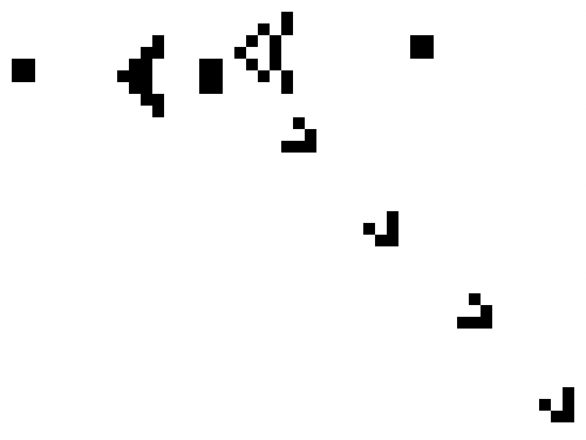

<!--
Copyright 2020 Malte Kliemann, Ole Kliemann

This file is part of DrAutomaton.

DrAutomaton is free software: you can redistribute it and/or modify it
under the terms of the GNU General Public License as published by the
Free Software Foundation, either version 3 of the License, or (at your
option) any later version.

DrAutomaton is distributed in the hope that it will be useful, but
WITHOUT ANY WARRANTY; without even the implied warranty of
MERCHANTABILITY or FITNESS FOR A PARTICULAR PURPOSE.  See the GNU
General Public License for more details.

You should have received a copy of the GNU General Public License along
with DrAutomaton.  If not, see <https://www.gnu.org/licenses/>.
-->

# DrAutomaton user guide

This tutorial will show you how to configure, display and interact with
a cellular automaton using **DrAutomaton** by the example of
Gosper's glider gun (see below).
The impatient may skip right ahead to
[Creating a cellular automaton](#creating-a-cellular-automaton).

### Table of contents

* [Basics: 2D cellular automata](#basics-2d-cellular-automata)
  + [Space class](#space-class)
  + [Cellular class](#cellular-class)
* [Creating a cellular automaton](#creating-a-cellular-automaton)
* [Geometries](#geometries)
* [Implementing rules](#implementing-rules)

## Basics: 2D cellular automata

A _2D cellular automaton_ (CA) operates on an underlying two-dimensional _space_,
divided into rectangular _cells_.
Each cell has a current state _state_.
According to a set of _rules_ defined by the cellular automaton,
the cells change their state in the next _generation_.

For example,
Conway's Game of Life uses two states, 
_dead_ and _alive_,
and the cells change depending on the number of dead and live cells in
their neighborhood.
For details,
see [Wikipedia: Conway's Game of Life](https://en.wikipedia.org/wiki/Conway%27s_Game_of_Life)

### Space class

The underlying space is represented by the `Space` class.
Every `Space` object
has a limited `width()` and `height()`,
unlike its mathematical counterpart.
Each of its cells may be acquired
by virtue of its _cell coordinates_,
`(x, y)`,
where `0 <= x < width()` and `0 <= y < height()`.
The top-left cell is `(0, 0)`,
and the indexing is column-major.

The space may or may not be equipped with a _geometry_.
By default, the cellular automaton operates on a rectangular space in a plane,
but `Space` may also represent 
A geometry defines the states of cells _outside_ of the finite bounds of the space,
effectively either extending the space infinitely using default values,
or glueing the sides of the space together,
creating such geometries as a torus
([Wikipedia: Torus](https://en.wikipedia.org/wiki/Torus))
or the real projective plane
([Wikipedia: Real projective plane](https://en.wikipedia.org/wiki/Real_projective_plane)).
More on that in [Geometries](#geometries).

### Cellular class

The `Cellular` class template is in charge of all asynchronous computations on the space
(call `doUpdate` to compute the next generation of cells).
Computations are done on the CPU,
although much higher framerates could be reached when parallelizing on the GPU).
It's template parameter `Rule` specifies a class which
implements the interface `IRule` and defines the exact way 
(for details, see [Implementing rules](#implementing-rules)).

Every `Cellular` class holds an underlying `Space` object
(created upon construction),
which it exposes to the `Model`
(more of that later).
Although the user is in charge of creating the `Cellular` object,
they should never _use_ it beyond specifying the `Rule` parameter
and (optionally) setting the geometry via 
```cpp
void setGeometry(std::shared_ptr<AbstractGeometry>);
```
(for details, see [Geometries](#geometries)).
Instead,
the `Cellular` object should always be driven by a model.

### Model/View classes

**DrAutomaton** uses the typical Model/View pattern for displaying
`Cellular` objects.

`Model` is a class template,
the template parameter is the `Rule`.
The model's job is to convert every 
generation of the cellular automaton into 
_vertices_ (type `std::vector<int>`).
Every vertex represents a cell of the CA.
The `View` uses these vertices as keys for the coloring map.

But the model only renders its _viewport_,
not the entire CA.
The viewport is a rectangle inside the underlying space
(by default,
the viewport is equal to the underlying space).
In particular,
the `width()` and `height()` of the model
aren't always equal to the `width()` and `height()` of the underlying space.

Every `Model` is driven by a `View`,
which inherits `QQuickItem`.
Furthermore,
`View` controls the framerate,
start/stop toggles and key/click events.
All of these can be configured using QML.

An important point is the conversion from state to vertex.
This is done by `static_cast`.
Therefore,
the state type of every rule must implement `operator int()`.
For details,
see [Implementing rules](#implementing-rules).

Note that `View` is not a `QQuickView` itself,
but a `QQuickItem`.
As such,
it can be registered to QML and used in `.qml` to create scenes.
A `QQuickView` is only required to render the scene
that is defined in the `.qml` file.

## Creating a cellular automaton

This tutorial is based on the example `samples/glider`,
in which we define a cellular automaton for displaying _Gosper's glider gun_.



Checkout `Glider.cpp`.
Start off by registering the `View` class to QML:
```cpp
qmlRegisterType<View>("DrAutomaton", 0, 0, "CellularView");
```
(We don't care about version numbers...)

Next, we create the `Cellular` object.
Unfortunately,
this is not a QML object and must be configured in the `.cpp`.
```cpp
auto cellular = std::make_shared<Cellular<GameOfLife>>(70, 70);
```
The template parameter is `GameOfLife`
(Conway's Game of Life, the set of rules we're using).
The arguments are width and height of the underlying space
(`70` by `70`).

The space will automatically be filled with the default state
(the result of default constructing `T = GameOfLife::State`),
in this case `GameOfLife::State::dead`.
We fill the space with live cells by using the `fill` method
of the underlying `Space` object:
```cpp
  cellular->space().fill(
      1, 1,
      {{".", GameOfLife::State::dead},
       {"O", GameOfLife::State::live}},
      // Gosper's glider gun, created by Bill Gosper in 1970.
      {".......................O",
       ".....................O.O",
       "............O.......O.O...........OO",
       "...........OO......O..O...........OO",
       "OO........OO....OO..O.O",
       "OO.......OOO....OO...O.O",
       "..........OO....OO.....O",
       "...........OO",
       "............O"}
    );
```
The last parameter is a `std::vector<std::string>`.
Every element of the vector represents one row of the underlying space.
Dead cells are represented by `.`, live cells by `O`
(this is the notation popularized by [www.conwaylife.com](www.conwaylife.com)).
This encoding is passed to the `fill` method
using the `std::unordered_map<std::string, T>` in the third parameter.
The `fill` method maps this pattern into the space.
The upper-left character corresponds to the cell with coordinates
equal to the first two parameters.

The geometry of the space is defined as `Border`,
with default value equal to `GameOfLife::State::dead`:
```cpp
auto geometry = std::make_shared<geometry::Border<GameOfLife>>();
geometry->setDefault(GameOfLife::State::dead);
cellular->setGeometry(std::move(geometry));
```
This means that when the `GameOfLife` rules access
a cell that is outside the bounds of the underlying space,
asy `(-1, 23)`,
then this cell will count as dead.
(This will happen,
for example,
every time the Moore neighborhood of a cell at the boundary
of the underlying space is accessed,
say `(0, 23)`.)
The geometry should always be set via `Cellular::setGeometry`,
not `Space::setGeometry`.<sup>1</sup>


The viewport of the model is configured to only show
a 4:3 rectange wedged in the upper-left corner of the space:
```cpp
auto model = std::make_shared<Model<GameOfLife>>(std::move(cellular));
model->setViewport(0, 0, 52, 39);
```
This will create the illusion that the CA operates on an infinite space,
when actually the gliders crash into an invisible wall right outside the viewport.

Next up is QML configuration,
which is quite straightforward:
```cpp
QQuickView view;
view.setSource(QUrl{"qrc:/glider.qml"});
```
This is the usual pattern
(there's a `.qrc` file which points to `glider.qml`, which configures the QML scene).
Let's take a look at `glider.qml`!

When defining a CA without any keyboard or mouse interaction,
it would be perfectly reasonable to do this:
```cpp
CellularView
{
  id: root
  width: 800
  height: 800
}
```
(Cf. `samples/cyclic`.)
Let's skip over the `width` and `height` parameters
(these don't have to have anything relationship with the `width()` and `height()` of the model,
although they should yield the same aspect ratio if you want square cells).

If you want keyboard or mouse interaction,
extra source code is required.
For mouse input,
we place a `MouseArea` together with `CellularView` into a root `Item`,
then connect the `onPressed`/`onPositionChanged` to the `onClicked` handler of `View`.
Clicking a cell will call the rule's `increment` method,
which will increment the clicked cell's state:
```cpp
// Forward mouse events.
MouseArea
{
  anchors.fill: parent
  acceptedButtons: Qt.LeftButton

  onPressed:
  {
    view.onClicked(mouse.x, mouse.y)
    mouse.accepted = true
  }
  onPositionChanged:
  {
    view.onClicked(mouse.x, mouse.y)
    mouse.accepted = true
  }
}
```

For keyboard input,
the `root` object requires `focus`.
Our typical setup is to map `1` to `4` to different framerates,
space bar to start/stop toggle and return to `showNextGeneration`.
The last one allows you to advance the CA by one generation
_without_ toggleing the CA on/off:
```cpp
// Key mapping.
focus: true
Keys.onPressed:
{
  switch(event.key)
  {
    case Qt.Key_1: { view.setFramerate( 3); break; }
    case Qt.Key_2: { view.setFramerate( 8); break; }
    case Qt.Key_3: { view.setFramerate(20); break; }
    case Qt.Key_4: { view.setFramerate(60); break; }
    case Qt.Key_Space: { view.toggle(); break; }
    case Qt.Key_Return: { view.showNextGeneration(); break; }
  }
}
```

The configuration of the `View` object itself can be done in QML
using the `Component.onCompleted` slot.
You can set the color using
```
void setColor(int vertex, int r, int g, int b);
```
which sets the RGB values of the color of `vertex`,
or the framerate (in fps/Hz).
Using `start()` or `toggle()`,
the CA may be started upon creation.
```cpp
CellularView
{
  id: view
  objectName: "view"

  anchors.fill: parent
  anchors.margins: 0

  Component.onCompleted:
  {
    setColor(0, 255, 255, 255)
    setColor(1,   0,   0,   0)
    setFramerate(8)
    start()
  }
}
```
Here, we're mapping dead cells (`0`) to white `(255, 255, 255)`
and live cells (`1`) to black `(0, 0, 0)`.

Finally, we need to go back to the C++ side.
In fact,
we have to set the model of the `View` object that was created on the QML side:
```cpp
auto automaton_view = view.rootObject()->findChild<View*>("view");
automaton_view->setModel(std::move(model));
```
(This is why we need the `objectName` field in `CellularView`.)

If you'd rather use C++ for configuring the `Cellular` object,
this can be done by calling the same methods as in the `Component.onCompleted` slot 
on the C++ side:
```cpp
automaton_view->setColor(0, 255, 255, 255);
automaton_view->setColor(1,   0,   0,   0);
automaton_view->setFramerate(8);
automaton_view->start();
```

<sup>1</sup>
`Cellular` actually holds two instances of `Space`,
the one exposed to `Model`,
and a temporary for computations
(obviously, the computations cannot be done in place).
Following the computation,
the temporary is moved onto the exposed instance
and then replaced with a new copy.
Thus, 
the effects of setting the geometry via `space().geometry(/* ... */)`
will last for only one frame,
followed most likely by a segfault when `rule_` dereferences a `nullptr`.

## Geometries

The role of geometries is to allow any `int` to be used as coordinates
for a cell using modulo operations or default values.
This changes the geometry of the underlying space from a rectangle in a plane
to that of a torus, a projective plane, a Möbius strip, a Klein bottle, a Cylinder, etc.

The problem a programmer faces when implementing rules
such as Conway's Game of Life is that at the boundaries of the space
the notions of neighborhood (Moore, (extended) von Neumann, etc.) fails
due to the finiteness of the underlying space:
If the space has dimensions `20x30`,
then what are the cells in the Moore neighborhood of the cell at `(0, 17)`?
Does it contain `(-1, 17)`? If yes, which cell is it?

Geometries provide a convenient and unified way for implementations of rules
to apply the notion of neighborhood,
even on a computer.
The idea is to somehow provide a value,
even if the space doesn't have a cell at coordinates `(-1, 17)`.
In case of the torus geometry,
instead of the out-of-bounds coordinates `(-1, 17)`,
the coordinates are replaced by their unique representatives mod. width (resp. height)
in the interval `[0, width)` (resp. `[0, height)`).
This amounts to glueing the horizontal and vertical edges of the rectangle together,
forming a donut-shaped space (called a flat torus).

Other geometries use default values,
such as `geometry::Border`,
which returns a default value on all out-of-bounds coordinates,
effectively creating a wall of cells with uniform state.

The geometry is only used when calling `Space::geometricCell`,
_not_ used when calling `Space::cells` (`const` and non-`const`).
As it returns references to default values,
only a `const`-version of `geometricCell` exists.
It would be a good rule to _only_ use `geometricCell` in rule implementations,
and let the user worry about space bounds everywhere else.

Geometry classes are contained in the namespace `geometry`.

## Implementing rules

The rules are injected into the `Cellular` object using templates.
To create new rules, you must implement a class that satisfies the
interface specified in `src/IRule.h`:

```cpp
/* Interface for rules --- not to be included in any code! */
class IRule
{
public:
  using State = T;  // Where T is a type with operator int();

  // Compute the state of the cell at the coords `(x, y)` of `space` in
  // the next generation.
  T transition(int x, int y, const Space<T>& space);

  // Return the state obtained by incrementing the state of `t` by one.
  T increment(const T& t);
};
```
(Once C++20 is commonplace, we will define a `Rule` concept.)

Note that the `State` type must be equipped with a conversion
`operator int()`,
as we rely on `static_cast`ing the states.
In most cases, an `enum` is sufficient as state class
(`Cyclic`, whose `CyclicState`s require the `isSucceededBy` method,
is an exception to this).

It may be helpful to take a look at already implemented rules under
`src/rules`.
If you've implemented a well-known rule or something really cool, we'd
be happy if you made it a contribution to **DrAutomaton**.
Let us know!
